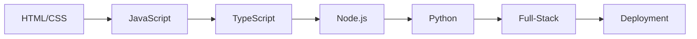

# 🚀 Zero to Intermediate Full-Stack Developer in 12 Weeks

[](https://github.com/wanjuifavour/Beginner-Web-Crash-Course.git)
[](https://opensource.org/licenses/MIT)

_A comprehensive curriculum taking students from absolute beginner to capable full-stack developer through progressive web development concepts._

## 📋 Table of Contents
- [Learning Path](#-learning-path)
- [Prerequisites](#-prerequisites)
- [Setup Instructions](#-setup-instructions)
- [Weekly Breakdown](#-weekly-breakdown)
- [Assignments](#-assignments)
- [Resources](#-resources)
- [FAQ](#-faq)

## 🧭 Learning Path


## 🛠️ Prerequisites
- Basic computer literacy
- Text editor (VS Code recommended)
- Modern web browser
- Internet connection

## 💻 Setup Instructions
1. **Install Development Tools**:
   ```bash
   # VS Code: https://code.visualstudio.com/
   # Node.js: https://nodejs.org/
   # Python: https://www.python.org/
   
   # Verify installations
   node --version
   python --version
   ```
2. **Clone Repository**:
   ```bash
   git clone https://github.com/yourusername/reponame.git
   cd reponame
   ```

## 📅 Weekly Breakdown

### Week 1-2: Web Foundations
| Topic        | Concepts Covered                          | Assignment Preview          |
|--------------|-------------------------------------------|-----------------------------|
| HTML Basics  | Semantic tags, forms, accessibility       | Recipe page with form       |
| CSS Fundamentals | Flexbox, responsive design, animations | Styled restaurant menu      |

### Week 3-4: Programming Core
```javascript
// Sample Week 3 Assignment
function toggleMenu() {
  const nav = document.querySelector('nav');
  nav.classList.toggle('active');
}
```

[View full curriculum timeline](TIMELINE.md)

## 📚 Assignments
- Progressive complexity matching course progress
- Pre-configured starter files in `/assignments/week-X`
- Solution templates available in `/solutions` after deadline
- Validation checklist for each submission:
  ```markdown
  - [ ] Functional requirements met
  - [ ] Clean code practices
  - [ ] Responsive design
  - [ ] Error handling
  ```

## 📦 Project Structure
```
/repo-root
├── lessons/
│   ├── week-01-html/
│   │   ├── examples/
│   │   └── cheatsheet.md
├── assignments/
│   ├── week-01/
│   │   ├── instructions.md
│   │   └── starter-files/
├── resources/
│   ├── css-grid-guide.pdf
│   └── js-best-practices.md
└── project-showcase/
    └── final-project.md
```

## 🌐 Resources
| Type         | Links                                      |
|--------------|--------------------------------------------|
| Documentation| [MDN Web Docs](https://developer.mozilla.org) • [TypeScript Handbook](https://www.typescriptlang.org/docs/) |
| Tools        | [Postman](https://www.postman.com) • [MongoDB Atlas](https://www.mongodb.com/cloud/atlas) |
| Communities  | [FreeCodeCamp Forum](https://forum.freecodecamp.org) • [Stack Overflow](https://stackoverflow.com) |

## ❓ FAQ
**Q: Do I need prior programming experience?**<br>
A: No! This course starts from absolute basics.

**Q: How much time should I commit weekly?**<br>
A: Minimum 6-8 hours (2x lessons + assignments)

**Q: What if I get stuck?**<br>
A: Use our [discussion forum](https://github.com/wanjuifavour/Beginner-Web-Crash-Course.git/discussions) for help

---

> **Pro Tip**: Bookmark this README! It will be continuously updated with additional resources and course updates.